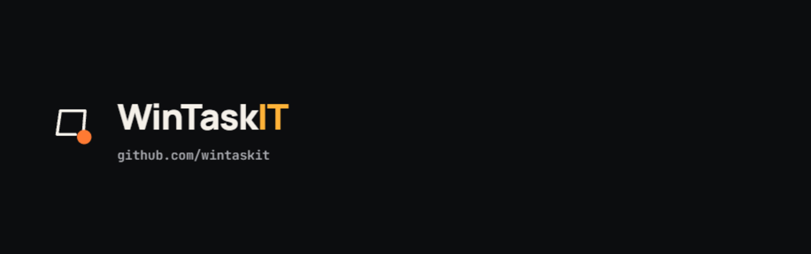
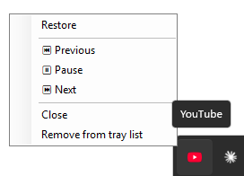
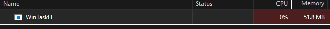

# WinTaskIT

<p align="center">
  <a href="https://itsiurisilva.github.io/WinTaskIT/">
    
  </a>
</p>

<p align="center">
  <a href="https://github.com/itsiurisilva/WinTaskIT/releases/latest"></a>
  
  
  <a href="LICENSE"></a>
  
  
  <a href="https://github.com/itsiurisilva/WinTaskIT/pulls"></a>
</p>

<p align="center">
  <strong>Keeps app windows like YouTube-as-an-app alive in the system tray instead of cluttering your taskbar, with Play/Pause/Next/Previous right from the tray icon.</strong>
</p>

<p align="center">
  <a href="#why">Why</a> ·
  <a href="#features">Features</a> ·
  <a href="#how-it-works">How it works</a> ·
  <a href="#screenshots">Screenshots</a> ·
  <a href="#quick-start">Quick Start</a> ·
  <a href="#uninstall">Uninstall</a> ·
  <a href="https://itsiurisilva.github.io/WinTaskIT/">Full guide</a>
</p>

## What it does

A tiny Windows background utility that sends specific app windows to the
system tray instead of the taskbar when you minimize them. Always, or only
while they're actually playing audio. You pick, per app.

## Why

Minimizing an installed web app window (YouTube as a Chrome "app," for
example) still leaves a taskbar button sitting there. Native desktop media
players solved "play quietly and stay out of my taskbar" a couple of
decades ago; the installed-web-app world never did.

WinTaskIT patches that gap: send the window to the tray, keep the audio
playing, control playback right from the tray icon.

> [!TIP]
> Pair WinTaskIT with [uBlock Origin Lite](https://github.com/uBlockOrigin/uBOL-home).
> WinTaskIT keeps the tab alive quietly in the tray; uBlock Origin Lite stops
> it from burning CPU/bandwidth on ads while it's out of sight.

## Features

- **Per-app tray rules** - always send to tray, or only while it's actually playing audio.
- **Tray media controls** - Play/Pause, Next, Previous, and Close from the tray icon's right-click menu.
- **Works with more than YouTube** - anything with an Application User Model ID: installed web apps, PWAs, most modern Windows apps.
- **Invisible until needed** - no persistent tray icon of its own; one appears only for windows you've sent to the tray.
- **Lightweight** - about 50 MB of memory and 0% CPU in Task Manager while it's running. No background services, no telemetry.
- **No admin rights** - installs per-user, nothing system-wide.
- **Clean uninstall** - removes the startup entry, the Win+R shortcut, and all saved settings. No leftovers.

## How it works

- Runs invisibly in the background, no persistent tray icon of its own.
- Watches every top-level window for its Application User Model ID (AUMID), the same id Windows uses to identify installed web apps/PWAs, as it starts to minimize.
- If that window's AUMID is on your configured list, it hides the window and shows a tray icon instead, either always ("Always send to tray") or only while it's actually producing sound ("Only while playing audio," checked the same way your volume flyout's "now playing" widget does).
- Click the tray icon to restore the window. Right-click it for Play/Pause, Next, Previous, Close, or to remove it from the tracked list.

## Settings

Launch `WinTaskIT.exe` a second time (or type `wintaskit` into Win+R) to open
Settings. From there:

- Add windows from what's currently open.
- Enable or disable individual entries.
- Toggle "Run at Windows startup."
- Right-click any entry to switch it between "Always send to tray" and "Only while playing audio."

## Screenshots

<table>
  <tr>
    <td align="center" width="50%">
      <br>
      <sub>YouTube playing quietly from the tray, full transport controls a right-click away. The feature nobody promised, delivered anyway.</sub>
    </td>
    <td align="center" width="50%">
      <br>
      <sub>What "lightweight" looks like in Task Manager while it's running: 0% CPU, ~50 MB of memory.</sub>
    </td>
  </tr>
</table>

## Quick Start

1. Download the setup zip from [the latest release](https://github.com/itsiurisilva/WinTaskIT/releases/latest).
2. Unzip it and run `WinTaskIT-Setup.exe`, a normal installer wizard. No admin rights needed, it installs just for your user account (to `%LocalAppData%\Programs\WinTaskIT`).
3. Launch it once (or press Win+R and type `wintaskit`) to open Settings and add the windows you want tracked.

## Uninstall

- **The normal way:** Settings → Apps → Installed apps → WinTaskIT → Uninstall.
- **From the app:** relaunch the exe to open Settings and click **Uninstall...**.

Either one clears the startup registration, the `wintaskit` Win+R shortcut,
and all saved settings.

## Build from source

Requires the [.NET 8 SDK](https://dotnet.microsoft.com/download/dotnet/8.0).

```sh
dotnet build                          # local debug build
dotnet publish -r win-x64 -c Release  # single-file, self-contained WinTaskIT.exe
```

The published exe lands in
`WinTaskIT/bin/Release/net8.0-windows10.0.19041.0/win-x64/publish/`.

To build the installer, install [Inno Setup](https://jrsoftware.org/isinfo.php)
and compile `installer/WinTaskIT.iss` (`ISCC.exe /DMyAppVersion=X.Y.Z
installer\WinTaskIT.iss`). Pushing a `vX.Y.Z` tag also builds and publishes
this automatically via GitHub Actions.

## Links

- **Full guide, FAQ, and download:** [itsiurisilva.github.io/WinTaskIT](https://itsiurisilva.github.io/WinTaskIT/)
- **License:** MIT -> see [LICENSE](LICENSE).
